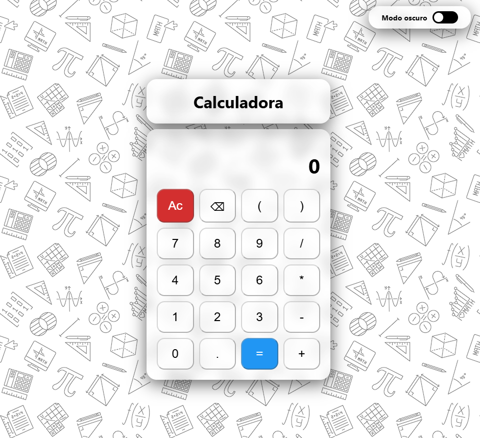

# 🧮 Calculadora Moderna
Una calculadora web moderna con modo claro y oscuro, diseñada con HTML, CSS y JavaScript.

# 🚀 Características
- Operaciones básicas: suma, resta, multiplicación y división.
- Modo claro/oscuro con cambio dinámico.
- Soporte para teclado: podés usar tanto clic como teclado físico.
- Interfaz visual moderna con fondo difuminado y animaciones suaves.
- Tema con variables CSS para fácil personalización.
- Botón borrar y función de "AC" para limpiar la pantalla.
- Estructura modular: HTML, CSS y JS separados para fácil mantenimiento.

# 🖥️ Vista previa

# 📦 Tecnologías
- HTML5
- CSS3 (variables, grid, efectos)
- JavaScript puro

## 🛠️ Cómo usar
1. Clona el repositorio:
        git clone https://github.com/tuusuario/calculadora-moderna.git
2. Abre index.html en tu navegador.